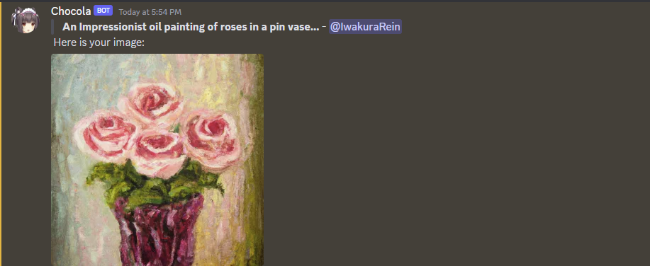
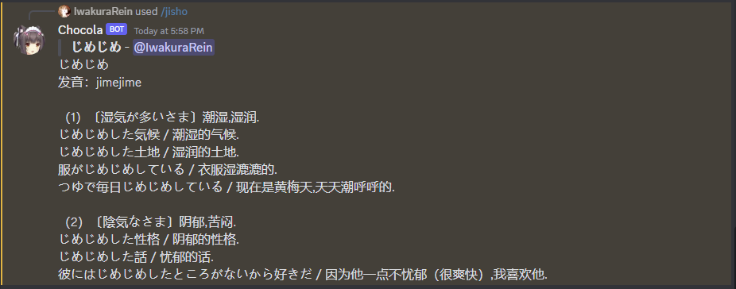

# Discord-ChatBot
My Discord bot based on ChatGPT API.

Reference: [Zero6992's chatGPT-discord-bot](https://github.com/Zero6992/chatGPT-discord-bot)

## Usage

- `/chat`: Chat with the bot.
- `/help`: Show help information.
- `/private`: Switch to private chat.
- `/public`: Conversation can be viewed by everyone.
- `/reset`: Completely reset conversation context.
- `/alarm [message] [minute] [second]` Set an alarm.
- `/gen-image`: Generate an image with Dalle・E API. Needs to set the Dalle token first.
- `/dalle-token`: Set your Dalle・E token.
- `/jisho`: The Japanese dictionary.
- `/illust`: Show random illustration from a public illustration API.
- `/photo`: Show a random photo from a public photo API.

## Install

```bash
pip -r requirements.txt
```

Then open the `.env` file and add your Discord bot token, your OpenAI key, and Discord channel ID.

The `starting-prompt.txt` defines the initial prompt sent to ChatGPT when the bot starts. The `starting-notification.txt` defines the message the bot sends to the channel when it starts.

## Examples



